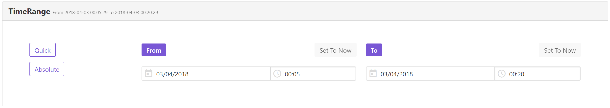

# TimeRange
Time Range Picker Based On Buefy And Vue


## Environment
- `vue 2.5.13`
- `buefy 0.6.3`


## Installation

```javascript
npm i -S GopherJ/TimeRange
```


## Usage

`main.js`
```javascript
import Vue from 'vue';
import Vuex from 'vuex';
import TimeRange from 'TimeRange';
import Buefy from 'buefy';
import 'buefy/lib/buefy.min.css';

Vue.use(Vuex);
Vue.use(Buefy);

const store = new Vuex.Store();

Vue.use(TimeRange, {
  store
});
```

`index.html`
```html
<link rel="stylesheet" href="//cdn.materialdesignicons.com/2.0.46/css/materialdesignicons.min.css">
```

`template`
```vuejs
<time-range labelPanel="TimeRange" labelStart="From" labelEnd="To" :auto-fold="true" @timeRangeChange="(n, o) => yourMethod(n, o)" @tagClicked="yourMethod"></time-range>
```


## Store

`state`
```javascript
this.$store.state.TimeRange.dateTimeStart
this.$store.state.TimeRange.dateTimeEnd
```

`mutations`
```javascript
this.$store.getters['TimeRange/EDIT_DATE_TIME_START'](new Date())
this.$store.getters['TimeRange/EDIT_DATE_TIME_END'](new Date())
```


## Demo

