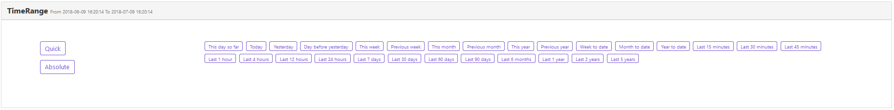

# VueTimeRange
Time Range Picker Based On Buefy And Vue


## Environment
- `vue 2.5.13`
- `buefy 0.6.3`


## Installation

```javascript
npm i -S vue-time-range
```


## Usage

`main.js`
```javascript
import Vue from 'vue';
import Vuex from 'vuex';
import TimeRange from 'vue-time-range';
import Buefy from 'buefy';
import 'buefy/lib/buefy.min.css';

Vue.use(Vuex);
Vue.use(Buefy);

const store = new Vuex.Store();

Vue.use(TimeRange, {
  store
});

new Vue({
    store,
    //...
});
```

`index.html`
```html
<link rel="stylesheet" href="//cdn.materialdesignicons.com/2.0.46/css/materialdesignicons.min.css">
```

`template`
```vue
<time-range label-panel="TimeRange" label-start="From" label-end="To" :auto-fold="true" @time-range-change="(n, o) => yourMethod(n, o)" @tag-click="yourMethod"></time-range>
```


## Store

`state`
```javascript
this.$store.state.TimeRange.dateTimeStart
this.$store.state.TimeRange.dateTimeEnd
```

`mutations`
```javascript
this.$store.commit('TimeRange/EDIT_DATE_TIME_START', new Date())
this.$store.commit('TimeRange/EDIT_DATE_TIME_END', new Date())
```


## Demo




 
 
## Contribute

1. create your own branch on gitlab
2. `git clone ssh://git@git.ubudu.com:10022/GopherJ/TimeRange.git`
    1. `cd TimeRange`
    2. `git checkout -b [branch name]`
    3. `make changes`
    4. `npm run build`
    5. `git add . && git commit -m "[message]" && git push origin [branch name]`
    6. `send PR`
